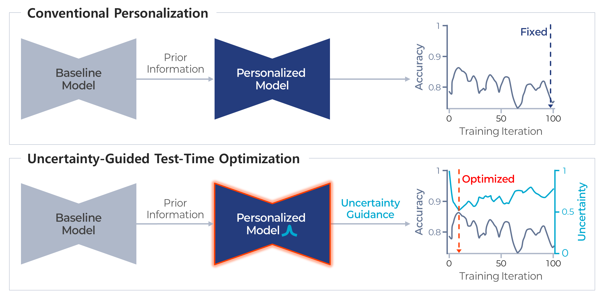

# 🧠 Uncertainty-Guided Test-Time Optimization (TTO)
### Personalizing Segmentation Models in Longitudinal Medical Imaging



> **Figure 1.** Conceptual comparison between fixed-epoch personalization and uncertainty-guided test-time optimization (TTO). The proposed method selects the personalization stopping point by minimizing predictive uncertainty, without access to test labels.

---

## 📄 Publication

**Chun J**, Castelo A, Woodland MK, et al.  
**Uncertainty-guided test-time optimization for personalizing segmentation models in longitudinal medical imaging.**  
*Medical Physics*. 2026;53:e70206.  
https://doi.org/10.1002/mp.70206

---

## 🧪 Dataset Used for Example (Open)

Examples in this repository use the **Head-and-Neck Tumor (HNT) MRI dataset**, which is publicly available.
https://hntsmrg24.grand-challenge.org/dataset/

Dataset characteristics:
- HNTS-MRG 2024 Challenge
- T2-weighted MRI
- GTVp and GTVn combined into a single foreground class
- Longitudinal pairs: pre-RT → mid-RT

Private pancreas and liver CT datasets used in the paper are **not distributed**.

---

## ⚙️ Environment

All experiments were conducted using:

```
pytorch/pytorch:2.1.1-cuda12.1-cudnn8-devel
```

Core dependency:
- `monai==1.4`

All Python dependencies are listed in `requirements.txt`.

---

## 🗂 Directory Structure

```
.
├── 3d_segmentation/
│   ├── swin_unetr_btcv_segmentation_3d_singleCh.py
│   ├── swin_unetr_btcv_segmentation_3d_singleCh_test.py
│   └── notebook_tto_one_cycle_analysis.ipynb
├── datasets/
├── requirements.txt
├── Dockerfile_uncertainty_tto
└── README.md
```

---

## 📓 One-Cycle Notebook (Baseline → Test)

The notebook below demonstrates a **single end-to-end cycle** on the HNT dataset:
1) baseline training  
2) baseline testing (inference) with **MCD-based uncertainty**  

Notebook:
- `3d_segmentation/notebook_tto_one_cycle_analysis.ipynb`

Notes:
- This notebook is for **illustration and analysis**. The official reproduction path is via the CLI scripts.
- Only **MCD** is demonstrated in the notebook.
- For **DE**, follow the paper setup: run inference with dropout disabled and aggregate **5 predictions** (one prediction per model), then compute the voxel-wise standard deviation and average it to obtain a scalar uncertainty score.

---

## 🚀 CLI Workflow (HNT Example): Train → Test → Personalization

This section provides a minimal command-line workflow for reproducing the HNT experiments.

### 1) Baseline Training (Fold JSON)

```bash
python 3d_segmentation/swin_unetr_btcv_segmentation_3d_singleCh.py \
  -exp_name '<EXP_NAME_BASELINE>' \
  -json_dir '<PATH_TO_DATASET_JSON>/<JSON_NAME>.json' \
  -size_cache_train 125 \
  -size_cache_valid 25 \
  -max_iterations 30000 \
  -channels_out 2 \
  -num_samples 10 \
  -intensity_range 0.0 255.0 \
  -fg_class 1 2 \
  -prob_drop 0.05
```

---

### 2) Baseline Testing (Inference)

```bash
python 3d_segmentation/swin_unetr_btcv_segmentation_3d_singleCh_test.py \
  -exp_name '<EXP_NAME_BASELINE>' \
  -json_dir '<PATH_TO_DATASET_JSON>/<JSON_NAME>.json' \
  -channels_out 2 \
  -prob_drop 0.05 \
  -intensity_range 0.0 255.0 \
  -fg_class 1 2 \
  -postfix '<POSTFIX>'
```

**Notes**
- Keep `-prob_drop` enabled to obtain **MCD-based uncertainty** during inference.

---

### 3) Patient-Specific Personalization (Fine-tuning on Prior Scan)

Personalization starts from the **pre-trained baseline checkpoint** and fine-tunes on a **single patient’s prior (primary) scan + label**.
The follow-up scan is **never** used for gradient updates.

```bash
python 3d_segmentation/swin_unetr_btcv_segmentation_3d_singleCh.py \
  -exp_name '<EXP_NAME_BASELINE>' \
  -json_dir '<PATH_TO_DATASET_JSON>/<JSON_NAME_PERSONALIZATION>.json' \
  -size_cache_train 1 \
  -size_cache_valid 1 \
  -max_iterations 100 \
  --personalize \
  -channels_out 2 \
  -prob_drop 0.05 \
  -postfix '<POSTFIX>' \
  -eval_num 1 \
  -fg_class 1 2 \
  -intensity_range 0.0 255.0 \
  -num_samples 10
```

**Notes**
- `<JSON_NAME_PERSONALIZATION>.json` should contain a single patient prior case used for fine-tuning.
- The current setup runs all 100 iterations and selects the optimal checkpoint using uncertainty minimization.

---

### ⏱ Practical Tip: Early Stopping for Real-World Use

While this repository evaluates all 100 personalization iterations and selects the optimal checkpoint retrospectively,
a more time-efficient deployment can adopt an **early stopping strategy** based on the **uncertainty curve trend**,
such as slope-based or plateau-based criteria.

---

## 📜 License

This repository builds upon examples and code adapted from the
[MONAI Tutorials](https://github.com/Project-MONAI/tutorials) repository,
which is licensed under the **Apache License 2.0**.

---

## 📚 Citation

If you use this work, please cite:

```bibtex
@article{Chun2026TTO,
  title   = {Uncertainty-guided test-time optimization for personalizing segmentation models in longitudinal medical imaging},
  author  = {Chun, Jaehee and Castelo, Austin and Woodland, McKell and others},
  journal = {Medical Physics},
  year    = {2026},
  volume  = {53},
  pages   = {e70206},
  doi     = {10.1002/mp.70206}
}